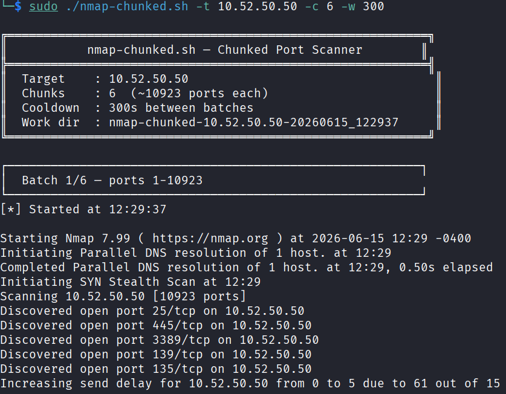
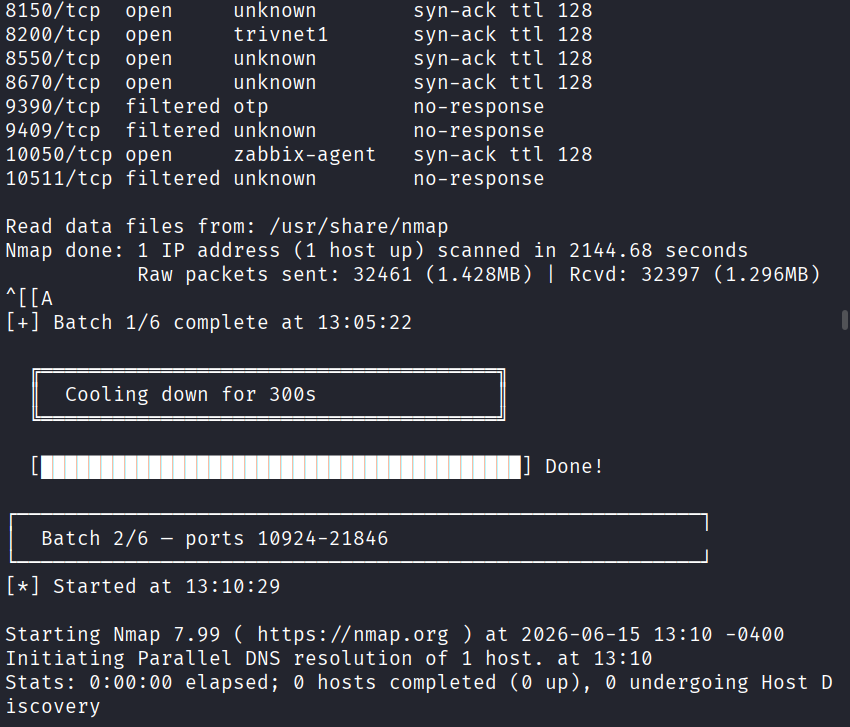
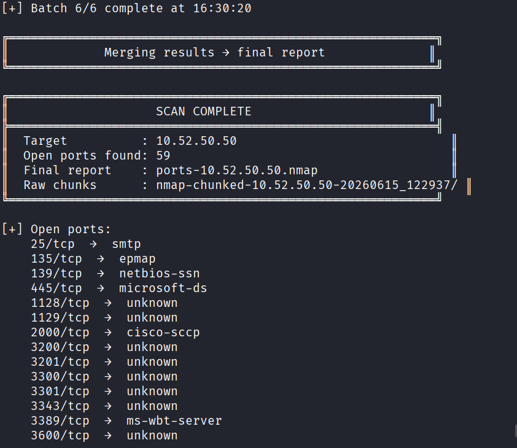
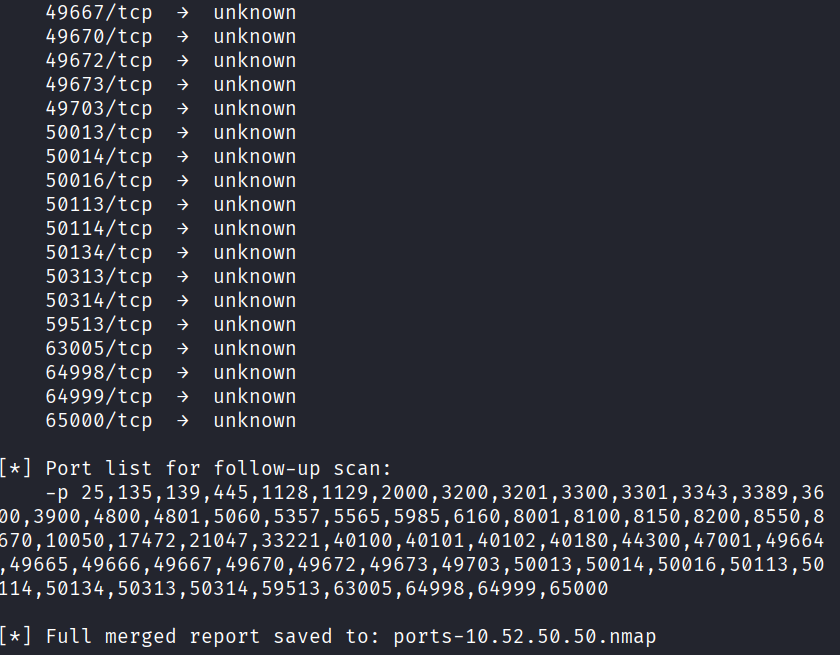

# nmap-chunked

**nmap-chunked** is a Small Bash wrapper around Nmap that performs a full TCP SYN port scan in chunks, adding a cooldown period between each batch to avoid being blocked by firewalls. Useful to scan all 65,535 TCP ports without sending the whole scan in a single burst.

---

## What it does

* Splits the full TCP port range into configurable chunks.
* Runs an Nmap SYN scan per chunk.
* Waits between batches using a visual cooldown bar.
* Saves raw output for every chunk.
* Merges all discovered open ports into a final report.
* Prints a clean port list for follow-up scans.

---

## Preview

Add your screenshots here:

```md







```

---

## Requirements

* Linux/macOS shell environment
* `bash`
* `nmap`
* Root privileges for SYN scan mode

Install Nmap on Debian/Ubuntu/Kali:

```bash
sudo apt update
sudo apt install nmap
```

---

## Usage

```bash
sudo ./nmap-chunked.sh -t <target_ip> [-c <chunks>] [-w <cooldown_secs>]
```

Options:

```text
-t <ip>       Target IP address
-c <n>        Number of chunks to split 65535 ports into
-w <secs>     Cooldown seconds between chunks
```

Default values:

```text
chunks   = 5
cooldown = 300 seconds
```

---

## Examples

Split the scan into 6 batches with 5 minutes between each one:

```bash
sudo ./nmap-chunked.sh -t 10.52.50.50 -c 6 -w 300
```

---

## Output

The script creates:

```text
ports-<target>.nmap
```

This is the final merged report with all discovered open ports.

It also creates a working directory like:

```text
nmap-chunked-<target>-YYYYMMDD_HHMMSS/
```

Inside that directory you will find the raw logs for each scan chunk:

```text
chunk_1_1-13107.nmap
chunk_1_1-13107.gnmap
chunk_1_1-13107.log
...
```

---

## Example final summary

```text
SCAN COMPLETE

Target          : 10.52.50.50
Open ports found: 5
Final report    : ports-10.52.50.50.nmap
Raw chunks      : nmap-chunked-10.52.50.50-20260615_120000/
```

The script also prints a ready-to-use port list for deeper scanning:

```bash
-p 22,80,443,445,3389
```

You can reuse it like this:

```bash
sudo nmap -sCV -Pn -vv -p 22,80,443,445,3389 10.52.50.50 -oN ports-10.52.50.50-versions.txt
```


